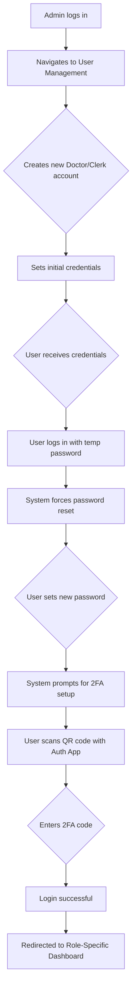
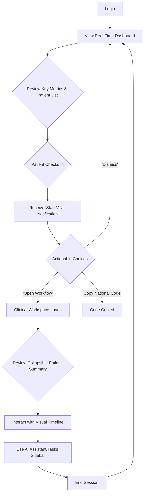
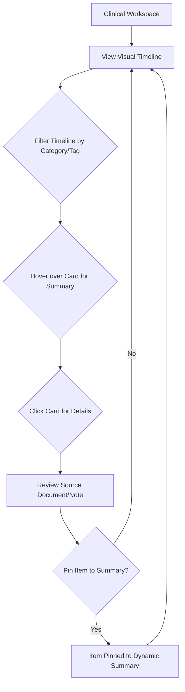
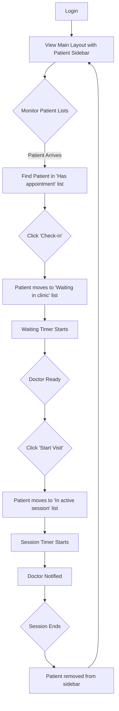
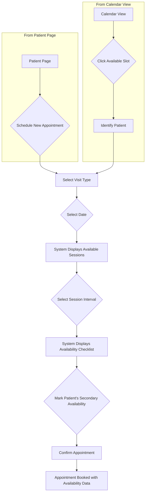
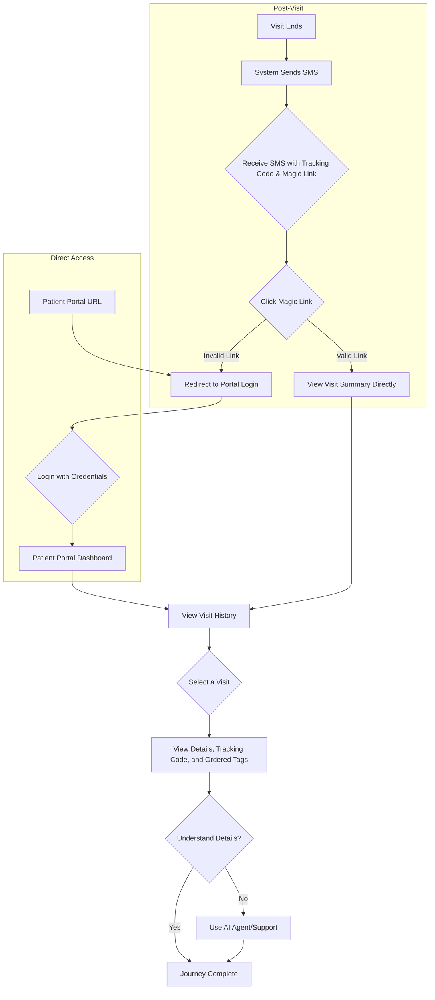
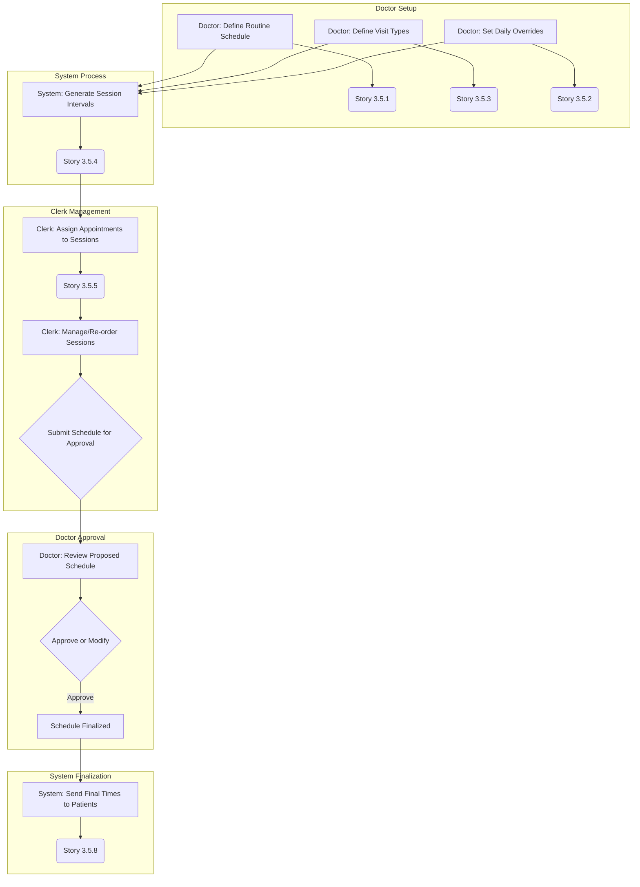

# UX Design Specification gemini-test

**Author:** Rey
**Date:** 2026-02-07
**Version:** 4.0

---

## Executive Summary

### Project Vision

The project aims to develop an AI-powered Electronic Health Record (EHR) system to transform clinic workflows by replacing inefficient paper-based systems. The core vision is to create an intelligent assistant that streamlines operations, significantly reduces patient wait times, and elevates the quality of patient care. The initial MVP will focus on foundational features such as a visual patient timeline and efficient appointment scheduling.

### Target Users

*   **Dr. Ahmadi (Doctor):** A medical professional (specialist or GP) seeking to overcome the frustrations of manual note-taking, data loss, and difficulty in recalling patient histories. Their primary goal is efficient and effective patient treatment, leveraging up-to-date approaches. **Primary Device: Tablet.**
*   **Sara (Clinic Clerk):** An administrative staff member responsible for scheduling, patient flow, and paperwork, who is challenged by inefficiencies in these areas. Her aim is to optimize scheduling and streamline administrative tasks. **Primary Device: PC/Desktop.**
*   **The Patient:** Individuals experiencing long wait times, confusion regarding medical instructions, and appointment management issues. They desire minimal waiting times, clear understanding of their treatment journey, and accessible health information. **Primary Device: Smartphone.**

## Core User Experience

### Defining Experience

The defining experience of the gemini-test EHR is: **"Instantly understand a patient's story through an intelligent, visual timeline."** This is the core interaction that, if nailed, will make the product a success. It's the "superpower" that the system gives to doctors, transforming a time-consuming and fragmented process into a seamless and insightful one.

### User Mental Model

*   **Current State:** Doctors are accustomed to a manual, "pull" model of information retrieval, where they must actively hunt for and piece together a patient's history from disparate sources (paper files, scanned documents).
*   **Desired State:** The gemini-test EHR will shift this to a "push" model, where the system proactively summarizes and visualizes the patient's story. The user's mental model will evolve from "data hunter" to "clinical decision-maker."

## Desired Emotional Response

The primary emotional goal for all users is to feel **empowered and intelligently supported**.

*   **For Doctors:** To feel confident, focused, and relieved.
*   **For Clerks:** To feel organized, efficient, and in control.
*   **For Patients:** To feel informed, reassured, and cared for.

## UX Pattern Analysis & Inspiration

### Inspiring Products Analysis

The UI mockups in `_bmad-output\planning-artifacts/ui-refs` are the primary source of inspiration and are directly linked to the user stories in `epics.md`.

*   **Login Page (`login-page.png`, `login-page.html`):** Provides the visual basis for **Story 1.1 (Login)**.

*   **Clerks Dashboard (`clerks-dashboard.png`, `clerks-dashboard.html`):** Inspires **Story 4.1 (Clerk's Main Layout)** with its dynamic patient sidebar and timers, and the overall dashboard-centric approach for clerks. It also implies the need for a task management component (**FR12, FR13**).
*   **Clerks Patient Page (`clerks-patient-page.png`, `clerks-patient-page.html`):** Provides the visual basis for **Story 2.5 (Clerk's Patient Information View)** and **Story 2.2 (Document Upload)**, showing the consolidation of patient info, visit history, and document management.
*   **Doctor Dashboard (`doctor-dashboard-draft/screen.png`, `doctor-dashboard-draft/code.html`):** Directly informs **Story 4.2 (Doctor's Real-Time Dashboard)**, showcasing the key metric cards and the real-time patient queue.
*   **Doctors Clinical Workspace (`doctors-clinical-workspace.png`, `doctors-clinical-workspace.html`):** This is a critical mockup that provides the visual foundation for the core doctor experience, including **Story 4.4 (Doctor's Clinical Workspace)**, **Story 2.4 (Interactive Visual Patient Timeline)**, and **Story 2.3 (Dynamic Patient Summary View)** via the collapsible header.
*   **Patient Portal Visits List (`patient-portal-visits-list/screen.png`, `patient-portal-visits-list/code.html`):** Guides the design for **Story 5.4 (Patient Portal - Detailed Visit History)**, emphasizing clarity and accessibility for patients.

# Design System Foundation

## Design System Choice

**Utility-First Framework: Tailwind CSS v4**

## Rationale for Selection

Tailwind CSS v4 is selected to leverage its **CSS-first architecture** and the high-performance **Oxide engine**. Since the provided HTML mockups use Tailwind, this version allows for direct utilization of class structures while using native CSS variables for design tokens. This setup reduces configuration overhead and ensures better performance compared to v3.

## Implementation Approach

The implementation will involve:

1.  **Project Setup:** Integrating Tailwind CSS v4 into the Next.js project by installing `tailwindcss`, `@tailwindcss/postcss`, and `postcss`.
2.  **PostCSS Configuration:** Configuring `postcss.config.mjs` to use the `@tailwindcss/postcss` plugin exclusively.
3.  **CSS-First Configuration:** Using a single global CSS file (`globals.css`) with the `@import "tailwindcss";` directive as the source of truth, removing the need for a JavaScript config file.
4.  **Theme Migration:** Defining custom theme tokens (colors, fonts, etc.) directly in the CSS file using the `@theme` block.

## Customization Strategy (Strict v4 Rules)

The customization strategy requires agents to follow these constraints:

* **Global CSS (`globals.css`):** This file is the single source of truth. All design tokens (e.g., `--color-primary`, `--font-display`) must be defined within the `@theme` block.
* **No `tailwind.config.js`:** Agents must **never** create or modify a `tailwind.config.js` or `tailwind.config.ts` file. 
* **Automatic Content Scanning:** No manual file paths are needed; Tailwind v4 automatically detects classes in the project.
* **Component Encapsulation:** React components will encapsulate utility classes. For dynamic styling, native CSS variables defined in the `@theme` block should be used.

## Technical Reference for Agents

### Correct `postcss.config.mjs`
```javascript
export default {
  plugins: {
    "@tailwindcss/postcss": {},
  },
};
```

### Correct `globals.css` structure

```css
@import "tailwindcss";
@theme {
  --color-primary: #3b82f6;
  --font-display: "Inter", sans-serif;
}
```

## User Journey Flows

This document provides user journey flows for the main epics of the project, following a consistent structure of a description, a Mermaid diagram, and a Q&A section.

---

### Journey 1: User Provisioning & Secure Login (Epic 1)

This journey describes the process of an administrator creating a staff account and the staff member logging in for the first time, including mandatory 2FA setup.



**Flow Design Questions & Answers:**

*   **How do users start this journey?** An administrator initiates the process by creating a new user account (Story 1.1, 1.2, 1.3). The new user starts their part of the journey when they first attempt to log in (Story 1.4).
*   **What information do they need at each step?** The admin needs the user's role and unique identifiers. The user needs their temporary credentials, a new password, and an authenticator app.
*   **What decisions do they need to make?** The admin decides the user's role. The user decides on their new password.
*   **What does success look like for this journey?** A new staff member is securely onboarded and can access their role-specific dashboard, having established their own credentials and a mandatory second factor of authentication (Story 1.5).

---

### Journey 2: Doctor's Daily Workflow & Patient Session (Epic 4)

This journey outlines the doctor's daily interactions, from reviewing their schedule on the real-time dashboard to engaging with a patient in the dedicated clinical workspace.



**Flow Design Questions & Answers:**

*   **How do users start this journey?** The doctor starts by logging in and viewing their real-time dashboard (Story 4.2).
*   **What information do they need at each step?** The dashboard provides key metrics (Time Bank, Patients in Clinic) and a patient list with statuses and timers. The 'Start Visit' notification provides patient context and quick actions (Story 4.3). The clinical workspace provides a comprehensive patient view (Story 4.4).
*   **What decisions do they need to make?** The doctor decides when to start a patient session and which actions to take from the notification. Within the workspace, they decide what information to review and what tasks to perform.
*   **What does success look like for this journey?** The doctor feels informed, in control of their schedule, and can efficiently manage patient consultations with all necessary information at their fingertips.

---

### Journey 3: Doctor's Understanding a Patient's Story (Epic 2)

This journey focuses on the core experience of using the interactive timeline to quickly grasp a patient's medical history.



**Flow Design Questions & Answers:**

*   **How do users start this journey?** This journey begins within the Clinical Workspace after a patient session has started (Story 4.4).
*   **What information do they need at each step?** They need a clear, chronological view of medical events, concise summaries, and easy access to detailed source documents (Story 2.4).
*   **What decisions do they need to make?** The doctor decides which events are most relevant, whether to trust the AI summary or view the source, and what information is important enough to "pin" to the patient's dynamic summary for future reference (Story 2.3).
*   **What does success look like for this journey?** The doctor achieves a confident understanding of the patient's case in minimal time, enabling informed clinical decisions.

---

### Journey 4: Clerk's Daily Operations & Patient Flow Management (Epic 4)

This journey illustrates the clerk's central role in managing the clinic's daily patient flow using their main layout with the persistent patient sidebar.



**Flow Design Questions & Answers:**

*   **How do users start this journey?** The clerk logs in and is immediately presented with their main operational view (Story 4.1).
*   **What information do they need at each step?** The clerk needs categorized patient lists with real-time statuses and timers to understand who is waiting, for how long, and who is currently with a doctor.
*   **What decisions do they need to make?** The clerk decides when to check patients in and when to initiate the "Start Visit" action to move the patient into the doctor's care.
*   **What does success look like for this journey?** A smooth, orderly patient flow with minimal manual tracking, reduced waiting times, and seamless communication between the clerk and doctors.

---

### Journey 5: Clerk's Advanced Appointment Scheduling (Epics 3 & 3.5)

This journey details the flexible, multi-step process of scheduling a patient appointment using the new session-based system.



**Flow Design Questions & Answers:**

*   **How do users start this journey?** The clerk can start from a specific patient's page (Story 3.1) or from the main calendar view (Story 3.2).
*   **What information do they need at each step?** They need the patient's identity, the desired visit type, and a clear view of available session intervals and the patient's broader availability for the day.
*   **What decisions do they need to make?** The clerk selects the most appropriate session for the appointment and records the patient's flexibility for potential rescheduling.
*   **What does success look like for this journey?** Appointments are booked efficiently, and the system captures valuable availability data that can be used later for schedule optimization.

---

### Journey 6: Patient's Accessing Visit Information (Epic 5)

This journey empowers patients by giving them easy, secure access to their health information via the patient portal, including a "magic link" for instant access.



**Flow Design Questions & Answers:**

*   **How do users start this journey?** The journey can be initiated by a "magic link" SMS received after a visit (Story 5.5) or by logging in directly to the patient portal (Story 5.3).
*   **What information do they need at each step?** Patients need their login credentials for direct access. In the portal, they need a clear list of past and upcoming visits, and for each visit, the tracking code and ordered tags (e.g., #آزمایش, #دارو) (Story 5.4).
*   **What does success look like for this journey?** The patient feels informed and empowered, with a clear, understandable record of their health journey and associated orders, accessible with minimal friction.

---

### Journey 7: Advanced Schedule Configuration & Management (Epic 3.5)

This journey describes the collaborative workflow between the doctor, clerk, and system to create, manage, and finalize the daily schedule.



**Flow Design Questions & Answers:**

*   **How do users start this journey?** The journey is initiated by the doctor configuring their fundamental availability and visit types.
*   **What information do they need at each step?** Doctors need an interface to define their time. Clerks need to see available sessions and patient availability. The system needs all this data to orchestrate the process.
*   **What does success look like for this journey?** A highly optimized daily schedule is created that respects the doctor's work patterns, accommodates different visit complexities, and provides predictability for patients, all managed through a collaborative, system-assisted workflow.


## Component Strategy

### Custom Components

#### Intelligent Visual Patient Timeline
*   **Purpose:** To provide doctors with an intuitive, chronological, and AI-summarized view of a patient's medical history.
*   **Source Mockup:** `doctors-clinical-workspace.png`, `doctors-clinical-workspace.html`
*   **Related Stories:** Story 2.4
*   **Anatomy:** Consists of a central chronological axis with event "cards". Each card displays a date, event type, a concise summary, and tags.
*   **Interaction Behavior:** Users can scroll, hover for summaries, click for details, and filter.

#### Clerk's Patient Sidebar
*   **Purpose:** To provide clerks with a persistent, real-time overview of the day's patient flow.
*   **Source Mockup:** `clerks-dashboard.png`, `clerks-dashboard.html`
*   **Related Stories:** Story 4.1
*   **Anatomy:** Contains categorized lists of patients ("In active session," "Waiting in clinic," "Has appointment"). Each list item is a `Patient Queue Card`.
*   **Interaction Behavior:** Lists and timers update in real-time. Action buttons manage patient flow.

#### Patient Queue Card
*   **Purpose:** To display essential patient information and status within various dashboard and sidebar contexts.
*   **Source Mockup:** `clerks-dashboard.png`, `clerks-dashboard.html`, `doctor-dashboard-draft/screen.png`, `doctor-dashboard-draft/code.html`
*   **Related Stories:** Story 4.1, 4.2
*   **Anatomy:** Card-based display showing patient name, appointment time, status, and timers. Includes quick action buttons.
*   **States:** Default, Hover, Active, Status-specific (color-coded).

#### Collapsible Patient Summary Header
*   **Purpose:** To provide doctors with a context-rich, space-efficient overview of a patient's critical information.
*   **Source Mockup:** `doctors-clinical-workspace.png`, `doctors-clinical-workspace.html`
*   **Related Stories:** Story 4.4, 2.3
*   **Anatomy:** A collapsible header with a toggle. The collapsed state shows key identifiers and tags. The expanded state reveals more detailed summary cards.
*   **Interaction Behavior:** A toggle button smoothly transitions between states.

#### Dashboard Metric Card
*   **Purpose:** To provide at-a-glance key performance indicators about daily operations.
*   **Source Mockup:** `doctor-dashboard-draft/screen.png`, `doctor-dashboard-draft/code.html`
*   **Related Stories:** Story 4.2
*   **Anatomy:** Individual cards displaying titles and values for key metrics.
*   **Interaction Behavior:** Display-only, but update in real-time.

#### Task List Component
*   **Purpose:** To display and manage tasks for clerks and doctors.
*   **Source Mockup:** `clerks-dashboard.png`, `clerks-dashboard.html` (in the "وظایف در انتظار" table)
*   **Related Stories:** FR12, FR13 (from PRD)
*   **Anatomy:** A table or list of task items, each with a description, patient, timestamp, priority, and action button.
*   **Interaction Behavior:** Users can create, edit, assign, and act on tasks.

## UX Consistency Patterns

### Button Hierarchy

**When to Use:** To guide users towards primary, secondary, or destructive actions.
**Visual Design:**
*   **Primary Action:** Prominent, filled button with a solid background color (e.g., `bg-primary`).
*   **Secondary Action:** Outlined button (e.g., `border border-gray-200`) or text-only button.
*   **Destructive Action:** Filled button with a red/rose color (e.g., `bg-rose-500`).
**Behavior:** Clear hover and active states (e.g., `hover:bg-primary-dark`). Disabled state for unavailable actions (e.g., `opacity-50 cursor-not-allowed`).

### Feedback Patterns

**When to Use:** To communicate system status, success, errors, warnings, or informational messages.
**Visual Design:**
*   **Success:** Elements with a green/emerald color theme (e.g., `bg-emerald-50`, `text-emerald-600`).
*   **Error:** Elements with a red/rose color theme (e.g., `bg-rose-50`, `text-rose-500`).
*   **Warning:** Elements with an orange/amber color theme.
*   **Info:** Elements with a blue/gray color theme.
*   **Loading:** Spinners, progress bars, or skeleton loaders (often using animated pulse classes like `animate-pulse`).
**Behavior:** Feedback can be transient (snackbars) or persistent (alerts).

### Form Patterns

**When to Use:** For all data input and collection from users.
**Visual Design:**
*   **Input Fields:** Styled with utility classes for background, border, and text color (e.g., `bg-background-light border border-border-light rounded-lg`).
*   **Validation:** Use border colors to indicate state (e.g., `focus:ring-primary`, `border-red-500` for an error). Error messages are displayed as small text below the input.
*   **Required Fields:** Indicated with an asterisk (*).

## UI Implementation Guidance

### The Mockup is the Law: A Two-Part System

All UI development **must** strictly adhere to the final UI mockups provided in the `_bmad-output\planning-artifacts/ui-refs` directory. These mockups serve as a two-part system for the single source of truth.

1.  **The PNG (`.png`): The Visual Target**
    *   This file is the **visual ground truth**. It dictates the final appearance.
    *   Use it to verify layout, spacing, colors, typography, and all visual details.
    *   The goal is to produce a UI that is a pixel-perfect match to this image.

2.  **The HTML (`.html`): The Structural & Styling Reference**
    *   This file provides the **implementation blueprint**.
    *   Use it to inspect the HTML structure (which tags to use, how they are nested).
    *   Use it to copy the exact **Tailwind CSS utility classes** needed to achieve the visual style shown in the PNG.

### The Workflow

*   **Mandatory Verification:** Before any UI task is considered complete, the resulting UI **must** be visually compared against the relevant **PNG file**.
*   **No Unauthorized Deviation:** Do not deviate from the mockups. If a mockup is ambiguous or a component state is missing, you must ask for clarification before proceeding.
*   **Agent Responsibility:** AI agents are responsible for:
    1.  Requesting both the `.png` and `.html` files for the relevant component/screen.
    2.  Analyzing the `.png` to understand the visual goal.
    3.  Analyzing the `.html` to understand the structure and extract the necessary Tailwind classes.
    4.  Generating React/JSX code that uses the extracted Tailwind classes to reproduce the UI shown in the `.png`.
    
A failure to adhere to this two-part system is a failure of the task.
