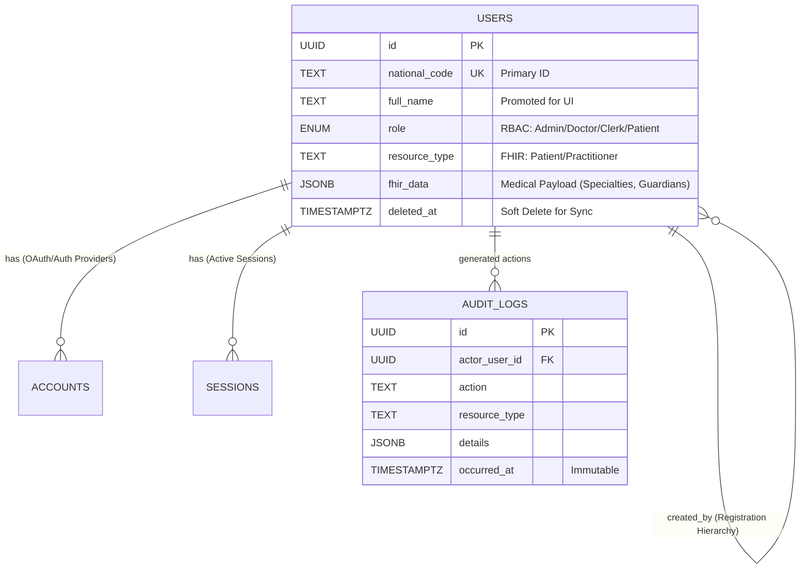
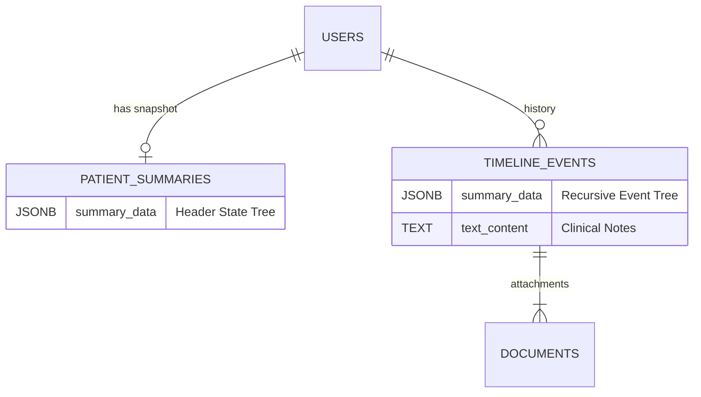

--- 
stepsCompleted: [1, 2, 3, 4, 5, 6, 7, 8]
inputDocuments:
  - C:\Users\FATER\Desktop\reyzone\gemini-test\_bmad-output\planning-artifacts\prd.md
  - C:\Users\FATER\Desktop\reyzone\gemini-test\_bmad-output\planning-artifacts\ux-design-specification.md
workflowType: 'architecture'
project_name: 'gemini-test'
user_name: 'Rey'
date: '2026-01-31'
status: 'complete'
completedAt: '2026-01-31'
---

# Architecture Decision Document

_This document builds collaboratively through step-by-step discovery. Sections are appended as we work through each architectural decision together._

## 1. Project Context Analysis

### 1.1. Requirements Overview

**Functional Requirements:**
The system is a multi-user EHR with role-based access for clerks, doctors, and patients. Key functionality includes patient registration, document management, a visual patient history timeline, appointment scheduling with automated reminders, real-time dashboards and notifications for clinical staff, and a patient portal for viewing visit history and prescription codes. The system must be responsive and optimized for the primary device of each user role: **PC for clerks, tablets for doctors, and smartphones for patients.**

**Non-Functional Requirements:**
The architecture will be heavily influenced by several critical NFRs. **Offline-first** functionality is paramount, requiring a robust data synchronization mechanism. **High availability (99.9%)** and **performance** are essential, with specific targets like UI feedback under 200ms and data-intensive views loading in under 3 seconds. **Security** is a major concern, with requirements for **HIPAA compliance**, encryption of ePHI at rest and in transit, role-based access control, and immutable audit logs. The system must be **scalable** to handle 10x growth. The patient portal has a strict **accessibility** requirement of WCAG 2.1 Level AA.

**Scale & Complexity:**
The project is of **high** complexity due to the combination of offline-first requirements, real-time features, AI integration, and stringent security and compliance needs.

- Primary domain: Full-stack (Web App with offline-first capabilities)
- Complexity level: High
- Estimated architectural components: 10-15 major components (e.g., Auth, Patient Service, Scheduling Service, Notification Service, AI Agent, P2P Sync, Web UI, Patient Portal UI)

### 1.2. Technical Constraints & Dependencies

- The application will be a Single-Page Application (SPA).
- Browser support is for modern browsers (Chrome, Firefox, Safari).
- The MVP will not have integrations with external systems like billing or labs, but the architecture should allow for future integration via HL7/FHIR.
- The AI Assistant will be a placeholder in the MVP.

### 1.3. Cross-Cutting Concerns Identified

- **Offline Synchronization:** A mechanism to ensure data consistency and integrity between the local device and the server, and potentially peer-to-peer.
- **Real-time Updates:** A system for pushing real-time updates to clients (e.g., WebSockets).
- **Security:** Encryption, authentication, authorization (RBAC), and audit logging must be implemented across the entire stack.
- **AI Integration:** The architecture must accommodate the future integration of AI agents for document analysis and other tasks, including the human-in-the-loop feedback mechanism.
- **Accessibility (WCAG 2.1 AA):** This will primarily impact the patient portal's frontend architecture and component design.

## 2. Starter Template Evaluation

### 2.1. Primary Technology Domain

A **self-hosted, full-stack application** featuring a relational source-of-truth database (PostgreSQL) with a dedicated offline-first and real-time synchronization layer.

### 2.2. Selected Starter: Manual Stack Composition

**Rationale for Selection:**
This stack was chosen as it provides the best of both worlds: the power and reliability of a standard relational database (PostgreSQL), combined with a dedicated, self-hostable service (PowerSync) to handle the complex requirements of offline-first and real-time multi-user synchronization. This modern architecture is a perfect fit for all stated project requirements.

1.  **Next.js:** A robust React framework for the user interface.
2.  **PostgreSQL:** A powerful, open-source relational database that will serve as the main source of truth.
3.  **PowerSync:** A service that synchronizes data between the central PostgreSQL database and local on-device databases.
4.  **SQLite:** The local database that will run on client devices (in the browser) to provide offline capabilities.

### 2.3. Initialization Commands

Project setup will be a multi-step process.

**1. Initialize the Next.js Application:**
This command scaffolds a new, interactive Next.js project.
```bash
npx create-next-app@latest
```

**2. Start the PostgreSQL Database (using Docker for development):**
This command runs a PostgreSQL server locally. The password should be replaced with a secure credential.
```bash
docker run -d --name my-postgres -p 5432:5432 -e POSTGRES_PASSWORD=mysecretpassword -v pgdata:/var/lib/postgresql/data postgres
```

**3. Start the PowerSync Service (using Docker for development):**
The PowerSync service is run via Docker Compose, using the configuration from their official self-host demo project. This will be set up as part of the project initialization.

**4. Add PowerSync Client SDK to the Next.js Project:**
This command installs the necessary PowerSync libraries into our Next.js application.
```bash
npm install @powersync/react @powersync/web @journeyapps/wa-sqlite
```

## 3. Core Architectural Decisions

### 3.1. Data Architecture

*   **Main Database:** **PostgreSQL** (self-hosted). It will serve as the central source of truth for all data.
*   **Offline Database & Sync:** The **PowerSync** service will manage synchronization. Data will be stored on the client devices in a **SQLite** database (running in the browser via WebAssembly).
*   **Hybrid Data Model:** We use a "Hybrid" approach. Standard relational columns (`id`, `date`, `status`) are used for high-frequency querying, sorting, and filtering. Complex, nested medical data (FHIR resources, dynamic forms) is stored in `JSONB` columns to allow flexibility without altering the schema.
*   **Offline-First Identity:** All Primary Keys are `UUID (v4)` generated on the client. This prevents ID collisions when multiple devices create data offline.
*   **Soft Deletes:** No data is ever physically deleted. We use `deleted_at` timestamps to ensure deletions sync correctly across devices.
*   **Data Modeling:** We will use standard relational data modeling practices: normalized tables, columns with appropriate data types, and foreign key constraints to ensure data integrity. A detailed schema is available in Appendix A.
### 3.1.2 Data Synchronization & Security Rules (PowerSync)

We utilize a **Dynamic Cohort & Role-Based Partitioning** strategy to ensure security and performance.

**1. The Security Partition (Clerk View)**
Clerks receive a "Vertical Slice" of the database. Clinical columns (`summary_data`, `fhir_data`, `text_content`) are strictly excluded from their synchronization rules. This ensures that even if a device is compromised, no ePHI payload exists on the device.

**2. The Performance Partition (Doctor View)**
Doctors receive a "Time-Windowed Cohort". Instead of syncing the entire patient database (which creates storage/performance bottlenecks), the tablet syncs:
* **Global Config:** Visit Types, Templates.
* **My Schedule:** Infinite history of their own schedule.
* **Active Cohort:** Full medical history ONLY for patients with appointments in the current window (e.g., Today +/- 3 days).
* **On-Demand Access:** A mechanism to temporarily grant sync access to a specific patient via Server-Side Search ("Break Glass" or "Open Chart").

**3. The Client Schema Strategy**
The local SQLite database (defined in `AppSchema.ts`) mirrors the Server Schema structure but uses `TEXT` columns for `JSONB` fields. Clinical columns in the Clerk's local database will technically exist but will always remain `NULL` due to the Sync Rules.

### 3.2. Authentication & Security

*   **Authentication Method:** We will implement **Username/Password + Two-Factor Authentication (2FA)** using the Time-based One-Time Password (TOTP) standard. This will be implemented using the **NextAuth.js** library, configured to use PostgreSQL as its database.
*   **Authentication Scope:** 2FA will be **mandatory for all staff** (Doctors, Clerks) and **optional for Patients**.
*   **Authorization Pattern:** We will use **Role-Based Access Control (RBAC)**. Every user in the `users` table in PostgreSQL will have a `role` column (`doctor`, `clerk`, or `patient`).

### 3.3. API & Communication Patterns

*   **Primary Data Sync:** The main communication pattern for data is handled by **PowerSync**. The frontend application will read and write directly to the local SQLite database. The PowerSync SDK will handle syncing this data to the server in the background.
*   **Server-Side Operations:** For small, specific actions that must happen on the server (e.g., sending an SMS notification), we will use **tRPC**. This provides full end-to-end type-safety between our Next.js frontend and backend, offering a superior developer experience for these types of operations.

## 4. Implementation Patterns & Consistency Rules

To ensure consistency, especially when AI agents are involved in development, the following patterns must be adhered to.

### 4.1. Naming Patterns

*   **Core Principle:** Use the idiomatic convention for each layer and transform at the boundaries.
*   **Database (PostgreSQL):** All table and column names will use `snake_case`. (e.g., `patients`, `first_name`).
*   **Application Code (TypeScript):** All variables, functions, and object keys will use `camelCase`. (e.g., `patientId`, `getPatientData`).
*   **Boundary Transformation:** A utility will be used to automatically transform `snake_case` from the database to `camelCase` for the application, and vice-versa. This ensures the application code remains clean and idiomatic.

### 4.2. Structure Patterns

*   **Project Organization:** A **Feature-Based** structure will be used. All code related to a single feature (e.g., UI components, API logic, hooks, tests for "patients") will be co-located within the same directory (e.g., `src/features/patients/`).

### 4.3. Format Patterns

*   **API Error Format (for tRPC):** All errors returned from our tRPC API will use a standard `{ code, message, details }` structure. The `code` will be a machine-readable string, `message` will be a human-readable summary, and `details` will be an optional array of specific issues, often generated automatically by Zod during validation.

### 4.4. Process Patterns

*   **Loading State Handling:** A dual strategy will be used:
    1.  **Actions (tRPC calls):** Buttons that trigger an action will be disabled and show an internal spinner while the action is in progress.
    2.  **Data Loading (PowerSync):** Pages or components loading their primary data will display a skeleton loader that mimics the shape of the content.

## 5. Project Structure & Boundaries

### 5.1. Key Structural Decisions
*   **Strict Boundary (`lib/db` vs `lib/powersync`):** We strictly separate Server-Side Database code (Postgres) from Client-Side Database code (SQLite). Importing Server code into Client components will cause build failures.
*   **Feature-Based UI:** Smart business logic lives in `components/features`, while reusable primitives live in `components/ui`.
*   **Modal-First Workflow:** "Create" actions (e.g., Register Patient) are handled via Modals (triggered from the Layout) rather than separate pages, preserving the user's context in the dashboard.

### 5.2. Complete Project Directory Structure

```text
gemini-test/
├── src/
│   ├── app/                        # Next.js App Router
│   │   ├── (auth)/                 # Login Pages
│   │   │   ├── login/
│   │   │   └── register/
│   │   │
│   │   ├── (clerk)/                # === CLERK WORKFLOW ===
│   │   │   ├── layout.tsx          # Shared Sidebar (contains Create Patient Modal trigger)
│   │   │   ├── dashboard/          # "My Tasks" / Queue
│   │   │   ├── schedule/           # Session Management (Drag & Drop)
│   │   │   └── patient/
│   │   │       └── [id]/           # The "Medical Record" View (Uploads)
│   │   │
│   │   ├── (doctor)/               # === DOCTOR WORKFLOW ===
│   │   │   ├── layout.tsx          # Doctor Sidebar (Timeline Nav)
│   │   │   ├── dashboard/          # Real-time Queue
│   │   │   └── patient/
│   │   │       └── [id]/           # The "Timeline" View & Care Plan
│   │   │
│   │   ├── (portal)/               # === PATIENT PORTAL ===
│   │   │   ├── layout.tsx
│   │   │   ├── dashboard/
│   │   │   └── documents/
│   │   │
│   │   ├── api/                    # Server Entrypoints
│   │   │   ├── auth/[...nextauth]/
│   │   │   ├── trpc/[trpc]/        # API Gateway
│   │   │   └── webhooks/           # SMS/Sync Webhooks
│   │   │
│   │   └── layout.tsx              # Root Providers (PowerSync, Auth)
│   │
│   ├── components/                 # UI Components
│   │   ├── ui/                     # Primitives (Button, Input)
│   │   ├── layout/                 # Sidebar, UserMenu
│   │   └── features/               # === SMART COMPONENTS ===
│   │       ├── patients/
│   │       │   └── RegisterPatientDialog.tsx  # Modal (No separate page needed)
│   │       ├── timeline/
│   │       │   ├── EventCard.tsx
│   │       │   └── PatientSummaryCard.tsx
│   │       ├── schedule/
│   │       │   ├── SessionGenerator.ts        # Logic for Epic 3.5
│   │       │   └── DragDropCalendar.tsx
│   │       └── operations/
│   │           └── NotificationToast.tsx
│   │
│   ├── lib/                        # Infrastructure
│   │   ├── db/                     # === SERVER-SIDE (Postgres) ===
│   │   │   ├── schema.ts           # Drizzle/Prisma Schema
│   │   │   └── index.ts
│   │   │
│   │   └── powersync/              # === CLIENT-SIDE (SQLite) ===
│   │       ├── AppSchema.ts        # Offline Schema Definition
│   │       ├── db.ts
│   │       └── mutations/          # Offline Write Queue
│   │
│   ├── server/                     # Backend Logic
│   │   ├── routers/                # tRPC Routers (API Boundary)
│   │   └── services/               # Heavy Logic (SMS, Scheduler)
│   │
│   └── types/                      # Shared TypeScript Definitions
│       ├── db.ts
│       └── fhir.ts
```

### 5.3. Architectural Boundaries

*   **Data Boundary:** The application's primary data boundary is the **PowerSync client**. All UI components must import from lib/powersync and use React hooks. They must not import from lib/db (Postgres) to prevent build errors.
*   **API Boundary:** The **tRPC API** (server/routers) is the strict boundary for server-side actions (e.g., sending SMS, regenerating schedules).
*   **FHIR Boundary:** Complex medical data is stored in `JSONB` columns mapping to FHIR resources where possible.

### 5.4. FHIR Compliance Boundary

To ensure interoperability and AI-readiness, the project enforces a **"FHIR-First" Data Boundary**. All features must map their data structures to standard FHIR Resources.

*   **Hybrid Schema Strategy:**
    *   **Core Relational Columns:** Critical fields for querying and sorting (e.g., `id`, `status`, `created_at`, foreign keys) are stored in standard PostgreSQL columns.
    *   **FHIR Data Payload:** Complex, nested, or domain-specific medical data is stored in a `JSONB` column named `fhir_data`.
    *   **No Custom Enums:** Status fields must use standard FHIR ValueSets (e.g., `gender` is `'male' | 'female'`, not `0 | 1`).

### 5.5. Guiding Principles for Offline-First Schema

*   **Client-Generated IDs:** All primary keys will be UUIDs generated on the client to prevent conflicts during offline creation.
*   **Immutable Records & Soft Deletes:** Records are never physically deleted from the database. A `deleted_at` timestamp will be used to mark records as deleted. This ensures that deletions can be synced to other clients.
*   **Timestamps for Conflict Resolution:** All tables will have `created_at` and `updated_at` timestamps. These will be used by the system, in combination with PowerSync's internal mechanisms, to resolve conflicts. The default strategy will be "Last Write Wins" based on the `updated_at` timestamp.
*   **Data Partitioning for Sync Rules:** The schema will include columns (e.g., `user_id`, `patient_id`) to facilitate PowerSync's "Sync Rules". This ensures that clients only download the data they are authorized to access.

## 6. Architecture Validation Results

### 6.1. Coherence, Coverage, and Readiness Validation ✅

A full validation of the architecture was performed.
*   **Coherence:** All technology choices (PostgreSQL, PowerSync, Next.js, tRPC, NextAuth.js) are compatible and form a robust, modern stack. The defined patterns for naming, structure, and processes are consistent with these technologies.
*   **Coverage:** All functional and non-functional requirements from the PRD are directly addressed by the architectural decisions. The offline-first, real-time, and security requirements are primary drivers of the chosen architecture.
*   **Readiness:** The architecture is documented in sufficient detail, with clear boundaries, patterns, and structure, to allow AI agents to begin implementation consistently.

### 6.2. Gap Analysis Results

*   **Critical Gaps:** None identified.
*   **Important Gaps:** Decisions regarding specific CI/CD pipelines, detailed logging formats, and server monitoring tools have been deferred. These can be decided during the implementation phase.


### 6.3. Architecture Completeness Checklist

**✅ Requirements Analysis**
- [x] Project context thoroughly analyzed
- [x] Scale and complexity assessed
- [x] Technical constraints identified
- [x] Cross-cutting concerns mapped

**✅ Architectural Decisions**
- [x] Critical decisions documented
- [x] Technology stack fully specified
- [x] Integration patterns defined

**✅ Implementation Patterns**
- [x] Naming conventions established
- [x] Structure patterns defined
- [x] Communication patterns specified
- [x] Process patterns documented

**✅ Project Structure**
- [x] Complete directory structure defined
- [x] Component boundaries established
- [x] Requirements to structure mapping complete

### 6.4. Architecture Readiness Assessment

*   **Overall Status:** **READY FOR IMPLEMENTATION**
*   **Confidence Level:** **High**
*   **Key Strengths:** Offline-first by design, robust security model, clear separation of concerns, and use of modern, scalable technologies.
*   **First Implementation Priority:** Setting up the project scaffolding, including the Docker Compose environment for PostgreSQL and PowerSync, and establishing the initial Next.js application structure.

---

## Appendix A: Detailed Database Schema

### Common Types & Enums

```sql
-- Identity & Roles
CREATE TYPE user_role AS ENUM ('doctor', 'clerk', 'patient', 'admin');

-- FHIR & Clinical Standards
CREATE TYPE fhir_gender AS ENUM ('male', 'female', 'other', 'unknown');
CREATE TYPE fhir_status AS ENUM ('active', 'inactive', 'error');

-- Clinical Events
CREATE TYPE event_category AS ENUM ('visit', 'lab', 'imaging', 'pathology', 'procedure', 'note', 'other');
CREATE TYPE highlight_tier AS ENUM ('none', 'expanded', 'fixed');

-- Scheduling
CREATE TYPE appointment_status AS ENUM ('scheduled', 'confirmed', 'checked_in', 'in_session', 'completed', 'cancelled', 'no_show');
```

### Epic 1: Identity & Access (Single-Table Strategy)
We use a Single-Table Inheritance pattern for Users to simplify Authentication and Hierarchy management.

FHIR Compatibility: The fhir_data JSONB column stores role-specific attributes (e.g., medical_license for Doctors, blood_type for Patients).



```sql
-- ==========================================
-- 1. ENUMERATIONS & TYPES
-- ==========================================
CREATE TYPE user_role AS ENUM ('doctor', 'clerk', 'patient', 'admin');
CREATE TYPE fhir_gender AS ENUM ('male', 'female', 'other', 'unknown');
CREATE TYPE fhir_status AS ENUM ('active', 'inactive', 'error');

-- ==========================================
-- 2. CORE IDENTITY TABLE (Hybrid Strategy)
-- ==========================================
CREATE TABLE users (
    id UUID PRIMARY KEY DEFAULT gen_random_uuid(),
    
    -- === IDENTITY & AUTHENTICATION ===
    -- National Code is the PRIMARY UNIQUE identifier for preventing duplicates.
    national_code TEXT UNIQUE, 
    
    -- Phone is NOT UNIQUE to allow children/elders to share a guardian's number.
    phone_number TEXT, 
    
    password_hash TEXT, 
    
    -- REGISTRATION HIERARCHY: Tracks who created this user.
    -- (Admin -> Doctor -> Clerk -> Patient)
    created_by UUID REFERENCES users(id), 
    
    -- RBAC: Application-level permissions
    role user_role NOT NULL DEFAULT 'patient',
    
    -- === PROMOTED COLUMNS (Performance & UI) ===
    -- Hoisted from FHIR data for fast sorting/filtering without parsing JSON.
    full_name TEXT, 
    gender fhir_gender, 
    birth_date DATE,
    status fhir_status DEFAULT 'active',
    
    -- === FHIR INTEROPERABILITY ===
    -- Distinguishes the Data Shape (Patient vs Practitioner)
    resource_type TEXT NOT NULL CHECK (resource_type IN ('Patient', 'Practitioner')),

    -- The "Payload": Stores role-specific medical data.
    -- IF role='doctor': { "qualification": [...], "specialty": ... }
    -- IF role='patient': { "contact": [...], "maritalStatus": ... }
    fhir_data JSONB NOT NULL DEFAULT '{}'::JSONB,
    
    -- === SECURITY METADATA ===
    totp_secret TEXT, -- Encrypted 2FA Secret
    totp_enabled BOOLEAN DEFAULT FALSE,
    
    -- === SYNC & OFFLINE METADATA ===
    created_at TIMESTAMPTZ NOT NULL DEFAULT NOW(),
    updated_at TIMESTAMPTZ NOT NULL DEFAULT NOW(),
    deleted_at TIMESTAMPTZ -- Critical for PowerSync soft deletes
);

-- ==========================================
-- 3. NEXTAUTH.JS SUPPORT TABLES
-- ==========================================
CREATE TABLE accounts (
    id UUID PRIMARY KEY DEFAULT gen_random_uuid(),
    user_id UUID NOT NULL REFERENCES users(id) ON DELETE CASCADE,
    type TEXT NOT NULL,
    provider TEXT NOT NULL,
    provider_account_id TEXT NOT NULL,
    refresh_token TEXT,
    access_token TEXT,
    expires_at BIGINT,
    token_type TEXT,
    scope TEXT,
    id_token TEXT,
    session_state TEXT,
    created_at TIMESTAMPTZ DEFAULT NOW(),
    updated_at TIMESTAMPTZ DEFAULT NOW(),
    UNIQUE(provider, provider_account_id)
);

CREATE TABLE sessions (
    id UUID PRIMARY KEY DEFAULT gen_random_uuid(),
    session_token TEXT UNIQUE NOT NULL,
    user_id UUID NOT NULL REFERENCES users(id) ON DELETE CASCADE,
    expires TIMESTAMPTZ NOT NULL,
    created_at TIMESTAMPTZ DEFAULT NOW(),
    updated_at TIMESTAMPTZ DEFAULT NOW()
);

CREATE TABLE verification_tokens (
    identifier TEXT NOT NULL,
    token TEXT UNIQUE NOT NULL,
    expires TIMESTAMPTZ NOT NULL,
    created_at TIMESTAMPTZ DEFAULT NOW(),
    updated_at TIMESTAMPTZ DEFAULT NOW(),
    UNIQUE(identifier, token)
);

-- ==========================================
-- 4. COMPLIANCE & AUDIT
-- ==========================================
CREATE TABLE audit_logs (
    id UUID PRIMARY KEY DEFAULT gen_random_uuid(),
    actor_user_id UUID NOT NULL REFERENCES users(id),
    action TEXT NOT NULL, -- e.g., 'VIEW_PATIENT', 'EXPORT_HISTORY'
    resource_type TEXT NOT NULL, -- e.g., 'Patient', 'Appointment'
    resource_id UUID NOT NULL,   
    details JSONB, -- Stores specific changed fields or context
    ip_address TEXT,
    user_agent TEXT,
    occurred_at TIMESTAMPTZ NOT NULL DEFAULT NOW() -- Immutable
);

-- ==========================================
-- 5. INDEXING STRATEGY
-- ==========================================
-- Partial Index: Prevent duplicate phones ONLY when they are provided (not null).
CREATE UNIQUE INDEX idx_users_unique_phone ON users(phone_number) WHERE phone_number IS NOT NULL;

-- JSONB Index: For querying arbitrary FHIR fields inside the payload.
CREATE INDEX idx_users_fhir_data ON users USING GIN (fhir_data);

-- Specialty Index: Specific fast lookup for Doctors by Specialty.
CREATE INDEX idx_users_specialty ON users USING GIN ((fhir_data -> 'qualification'));

-- Performance Indexes: For common UI filters and Lookups.
CREATE INDEX idx_users_role_status ON users(role, status);
CREATE INDEX idx_users_names ON users USING trgm(full_name); -- Requires pg_trgm extension
CREATE INDEX idx_audit_resource ON audit_logs(resource_id);
```


### Epic 2: Intelligent Timeline (Recursive & Files)
The Timeline is a structured tree of medical data, not just a flat list.

summary_data (JSONB): Stores a Recursive Tree of key-value pairs (e.g., Pathology -> IHC -> ER: Positive) to allow "Starring" items to the header.

documents: Works as a child table (One Event -> Many Files).


```sql
-- 1. PATIENT SUMMARIES (The Header State)
CREATE TABLE patient_summaries (
    id UUID PRIMARY KEY DEFAULT gen_random_uuid(),
    patient_id UUID NOT NULL REFERENCES users(id),
    
    -- THE HEADER STATE
    -- Stores the exact JSON structure you provided.
    -- Includes: info, disease_characteristics, pathology, imaging_baseline, etc.
    summary_data JSONB NOT NULL DEFAULT '{}'::JSONB,
    
    -- Metadata for the AI/Doctor
    last_updated_by UUID REFERENCES users(id),
    data_version TEXT DEFAULT '1.0',
    
    -- Sync Meta
    created_at TIMESTAMPTZ NOT NULL DEFAULT NOW(),
    updated_at TIMESTAMPTZ NOT NULL DEFAULT NOW(),
    deleted_at TIMESTAMPTZ,
    
    -- Enforce One Summary Per Patient
    UNIQUE(patient_id)
);

-- GIN INDEXING (Critical for "Find me all Stage IIA patients")
-- Allows deep querying like: WHERE summary_data -> 'disease_characteristics' -> 'stage' ->> 'overall_stage' = 'IIA'
CREATE INDEX idx_patient_summaries_data ON patient_summaries USING GIN (summary_data);


-- 2. TIMELINE EVENTS (The History)
CREATE TYPE event_category AS ENUM ('visit', 'lab', 'imaging', 'pathology', 'procedure', 'note', 'other');

CREATE TABLE timeline_events (
    id UUID PRIMARY KEY DEFAULT gen_random_uuid(),
    patient_id UUID NOT NULL REFERENCES users(id),
    
    -- Link to Session
    appointment_id UUID REFERENCES appointments(id),
    
    -- Display Info
    title TEXT NOT NULL, 
    event_date DATE NOT NULL, 
    category event_category NOT NULL,
    
    -- The Recursive Summary for THIS specific event
    summary_data JSONB NOT NULL DEFAULT '[]'::JSONB,
    
    -- Full Data (FHIR/OCR)
    full_data JSONB NOT NULL DEFAULT '{}'::JSONB,
    
    text_content TEXT, -- For Clinical Notes
    
    created_at TIMESTAMPTZ NOT NULL DEFAULT NOW(),
    updated_at TIMESTAMPTZ NOT NULL DEFAULT NOW(),
    deleted_at TIMESTAMPTZ
);

-- Indexes for filtering
CREATE INDEX idx_timeline_main ON timeline_events(patient_id, event_date DESC);
CREATE INDEX idx_timeline_filtering ON timeline_events(patient_id, category, event_date DESC);
CREATE INDEX idx_timeline_appointment ON timeline_events(appointment_id);

-- 3. DOCUMENTS (Files)
CREATE TABLE documents (
    id UUID PRIMARY KEY DEFAULT gen_random_uuid(),
    timeline_event_id UUID NOT NULL REFERENCES timeline_events(id),
    
    s3_key TEXT NOT NULL,
    file_name TEXT NOT NULL,
    file_type TEXT NOT NULL,
    file_size_bytes BIGINT,
    
    created_at TIMESTAMPTZ NOT NULL DEFAULT NOW(),
    deleted_at TIMESTAMPTZ
);
```
### Epic 3: Session-Based Scheduling
We use Session-Based Scheduling to support drag-and-drop.

clinic_sessions: Acts as a "Container" (e.g., "Morning Session").

queue_order: Defines the sequence of patients, allowing re-ordering without complex timestamp recalculations.

erDiagram
    DOCTOR_SCHEDULES ||--o| USERS : "config"
    CLINIC_SESSIONS }|--o| USERS : "containers"
    APPOINTMENTS }|--|| CLINIC_SESSIONS : "booked in"
    
    CLINIC_SESSIONS {
        DATE session_date
        TIME start_time
        TIME end_time
    }
    APPOINTMENTS {
        INT queue_order "Deterministic Sequence"
        JSONB patient_availability "Constraints"
        JSONB summary_data "Structured Plan"
    }

```sql
-- ENUMS
CREATE TYPE appointment_status AS ENUM ('scheduled', 'confirmed', 'checked_in', 'in_session', 'completed', 'cancelled', 'no_show');
CREATE TYPE day_of_week AS ENUM ('saturday', 'sunday', 'monday', 'tuesday', 'wednesday', 'thursday', 'friday');

-- 1. VISIT TYPES (Story 3.5.3)
-- Configuration for "Consultation", "Procedure", etc.
CREATE TABLE visit_types (
    id UUID PRIMARY KEY DEFAULT gen_random_uuid(),
    doctor_id UUID REFERENCES users(id), -- Null means "Clinic Default", specific ID means "Doctor Custom"
    
    title TEXT NOT NULL,
    color_code TEXT, -- For UI (e.g., #FF5733)
    estimated_duration_minutes INTEGER NOT NULL DEFAULT 15,
    complexity_level INTEGER DEFAULT 1, -- 1-5 scale
    
    -- "Procedure" vs "Consult"
    category TEXT NOT NULL, 
    
    created_at TIMESTAMPTZ NOT NULL DEFAULT NOW(),
    deleted_at TIMESTAMPTZ
);

-- 2. DOCTOR SCHEDULES (Story 3.5.1)
-- Stores the "Routine" (e.g., "I work Saturdays 8-12").
-- We use a Single Row per Doctor with JSONB for the weekly pattern.
-- This is easier to sync and update offline than 7 separate rows.
CREATE TABLE doctor_schedules (
    id UUID PRIMARY KEY DEFAULT gen_random_uuid(),
    doctor_id UUID NOT NULL REFERENCES users(id) UNIQUE,
    
    -- JSON Structure:
    -- {
    --   "saturday": { "active": true, "start": "08:00", "end": "14:00", "breaks": [{"start": "10:00", "end": "10:30"}] },
    --   "sunday": ...
    -- }
    weekly_routine JSONB NOT NULL DEFAULT '{}'::JSONB,
    
    updated_at TIMESTAMPTZ NOT NULL DEFAULT NOW()
);

-- 3. SCHEDULE OVERRIDES (Story 3.5.2)
-- Specific dates where the doctor is OFF or working different hours.
CREATE TABLE schedule_overrides (
    id UUID PRIMARY KEY DEFAULT gen_random_uuid(),
    doctor_id UUID NOT NULL REFERENCES users(id),
    
    override_date DATE NOT NULL,
    is_day_off BOOLEAN DEFAULT FALSE,
    
    -- If not day off, use these hours instead of routine
    start_time TIME,
    end_time TIME,
    
    note TEXT, -- "Conference", "Sick Leave"
    
    created_at TIMESTAMPTZ NOT NULL DEFAULT NOW(),
    deleted_at TIMESTAMPTZ
);

-- 4. CLINIC SESSIONS (Story 3.5.4)
-- These are the "Containers" generated by the system based on the Schedule.
-- Appointments are linked to these Sessions.
CREATE TABLE clinic_sessions (
    id UUID PRIMARY KEY DEFAULT gen_random_uuid(),
    doctor_id UUID NOT NULL REFERENCES users(id),
    
    session_date DATE NOT NULL,
    start_time TIME NOT NULL,
    end_time TIME NOT NULL,
    
    -- Status of the session itself (e.g., "Draft" is waiting for doctor approval)
    status TEXT NOT NULL DEFAULT 'open', -- open, locked, approved
    
    -- Sync Meta
    created_at TIMESTAMPTZ NOT NULL DEFAULT NOW(),
    updated_at TIMESTAMPTZ NOT NULL DEFAULT NOW(),
    deleted_at TIMESTAMPTZ
);

-- 5. APPOINTMENTS (Session Container)
-- Enhanced to act as the "Medical Folder" for the visit (Story 3.1, 3.5.5)
CREATE TABLE appointments (
    id UUID PRIMARY KEY DEFAULT gen_random_uuid(),
    
    -- Links
    clinic_session_id UUID NOT NULL REFERENCES clinic_sessions(id),
    patient_id UUID NOT NULL REFERENCES users(id),
    doctor_id UUID NOT NULL REFERENCES users(id), -- Denormalized for fast filtering
    visit_type_id UUID REFERENCES visit_types(id),
    
    -- Status Flow (Critical for Dashboards)
    status appointment_status NOT NULL DEFAULT 'scheduled',
    
    -- === 1. UNIFIED SUMMARY & PLAN STRUCTURE ===
    -- Holds findings (e.g., "Temp: 38C") AND structured plan goals.
    -- Replaces "clinical_summary" to allow starring/pinning items.
    summary_data JSONB NOT NULL DEFAULT '[]'::JSONB,
    
    -- === 2. NARRATIVE CONTENT ===
    -- The Doctor's written instructions/notes. 
    -- Replaces "clinical_plan" to match timeline_events structure.
    text_content TEXT,
    
    -- === 3. ORDERS & EXECUTION ===
    -- Structure: { "prescriptions": ["Metformin"], "labs": ["CBC"], "paraclinic": [] }
    orders_data JSONB NOT NULL DEFAULT '{}'::JSONB,

    -- 4. Tracking & Tags (From Epic 5)
    tracking_code TEXT, -- e.g. "INS-99201"
    visit_tags TEXT[] DEFAULT '{}', -- e.g. ["#Diabetes", "#Checkup"]
    
    -- Timestamps for KPIs
    scheduled_time TIMESTAMPTZ,
    checked_in_at TIMESTAMPTZ,
    session_started_at TIMESTAMPTZ,
    session_ended_at TIMESTAMPTZ,
    
    -- Ordering (Story 3.5.6)
    queue_order INTEGER DEFAULT 0,
    
    -- Availability Checklist
    patient_availability JSONB DEFAULT '{}'::JSONB,
    
    created_at TIMESTAMPTZ NOT NULL DEFAULT NOW(),
    updated_at TIMESTAMPTZ NOT NULL DEFAULT NOW(),
    deleted_at TIMESTAMPTZ
);

-- INDEXES
CREATE INDEX idx_appointments_session ON appointments(clinic_session_id);
CREATE INDEX idx_appointments_patient ON appointments(patient_id);
CREATE INDEX idx_appointments_date ON appointments(doctor_id, scheduled_time);
-- Real-time Dashboard Index
CREATE INDEX idx_appointments_status ON appointments(doctor_id, status) INCLUDE (patient_id, scheduled_time, queue_order) WHERE status IN ('checked_in', 'in_session');
-- New Index for finding visits by tags
CREATE INDEX idx_appointments_tags ON appointments USING GIN(visit_tags);
-- New Index for Full Text Search on the Plan/Notes
CREATE INDEX idx_appointments_text_content ON appointments USING GIN(to_tsvector('english', text_content));
-- New Index for searching inside the structured summary/plan
CREATE INDEX idx_appointments_summary ON appointments USING GIN (summary_data);
```

### Epic 4 & 5: Operations & Engagement
notifications: Includes a payload JSONB column to support dynamic 3-button actions (e.g., "Copy Code", "Open Chart").

sms_templates: Uses offset_minutes to allow granular reminders (e.g., "2 hours before").

```sql
-- 1. NOTIFICATIONS
CREATE TABLE notifications (
    id UUID PRIMARY KEY DEFAULT gen_random_uuid(),
    user_id UUID NOT NULL REFERENCES users(id),
    type TEXT NOT NULL, 
    title TEXT NOT NULL,
    message TEXT,
    payload JSONB, -- Actions: { "actions": [{ "label": "Check In", "url": "..." }] }
    read_at TIMESTAMPTZ,
    created_at TIMESTAMPTZ NOT NULL DEFAULT NOW()
);

-- ENUMS
CREATE TYPE sms_trigger_type AS ENUM ('appointment_reminder', 'post_visit_summary', 'manual_broadcast');
CREATE TYPE sms_status AS ENUM ('pending', 'sent', 'failed', 'delivered');

-- 1. SMS TEMPLATES (Configuration)
CREATE TABLE sms_templates (
    id UUID PRIMARY KEY DEFAULT gen_random_uuid(),
    
    -- Logic
    trigger_type sms_trigger_type NOT NULL,
    
    -- REVISED: Changed from days (integer) to minutes (integer)
    -- Allows "2 hours before" (-120) or "1 day before" (-1440)
    offset_minutes INTEGER DEFAULT 0, 
    
    -- Content
    -- e.g., "Hello [patient_name], appointment in 2 hours."
    message_template TEXT NOT NULL, 
    is_active BOOLEAN DEFAULT TRUE,
    
    created_at TIMESTAMPTZ NOT NULL DEFAULT NOW(),
    updated_at TIMESTAMPTZ NOT NULL DEFAULT NOW()
);

-- 2. SMS LOGS (History)
CREATE TABLE sms_logs (
    id UUID PRIMARY KEY DEFAULT gen_random_uuid(),
    patient_id UUID NOT NULL REFERENCES users(id),
    appointment_id UUID REFERENCES appointments(id),
    
    phone_number TEXT NOT NULL,
    message_body TEXT NOT NULL,
    status sms_status NOT NULL DEFAULT 'pending',
    provider_message_id TEXT,
    error_message TEXT,
    
    sent_at TIMESTAMPTZ DEFAULT NOW()
);

-- 3. MAGIC LINKS (Security)
CREATE TABLE magic_links (
    id UUID PRIMARY KEY DEFAULT gen_random_uuid(),
    patient_id UUID NOT NULL REFERENCES users(id),
    token_hash TEXT NOT NULL, 
    expires_at TIMESTAMPTZ NOT NULL,
    max_uses INTEGER DEFAULT 3,
    current_uses INTEGER DEFAULT 0,
    redirect_path TEXT DEFAULT '/portal/dashboard',
    created_at TIMESTAMPTZ NOT NULL DEFAULT NOW()
);

```

## Appendix B: Offline Sync Rules & Client Schema

### 1. PowerSync Manifest (`sync.yaml`)

```yaml
bucket_definitions:
  # 1. GLOBAL CONFIG (Static Data)
  global_config:
    parameters: []
    data:
      - SELECT * FROM visit_types
      - SELECT * FROM sms_templates

  # 2. CLERK VIEW (Operational Slice)
  # STRICT SECURITY: No clinical payloads (summary_data, fhir_data, etc.)
  clerk_view:
    parameters: []
    data:
      - SELECT id, national_code, phone_number, full_name, role, resource_type, gender, birth_date, status, created_at, updated_at, deleted_at FROM users WHERE role != 'admin'
      
      # Added 'patient_availability' for rescheduling and 'session_ended_at' for status
      - SELECT id, clinic_session_id, patient_id, doctor_id, visit_type_id, status, scheduled_time, checked_in_at, session_started_at, session_ended_at, queue_order, tracking_code, patient_availability, created_at, updated_at, deleted_at FROM appointments
      
      - SELECT * FROM clinic_sessions

  # 3. DOCTOR VIEW (Dynamic Time-Windowed Cohort)
  doctor_view:
    parameters: [user_id, start_date, end_date] 
    data:
      # A. My Schedule 
      - SELECT * FROM doctor_schedules WHERE doctor_id = bucket.user_id
      - SELECT * FROM schedule_overrides WHERE doctor_id = bucket.user_id
      - SELECT * FROM clinic_sessions WHERE doctor_id = bucket.user_id AND session_date BETWEEN bucket.start_date AND bucket.end_date

      # B. My Appointments (Clinical Data Included)
      - SELECT * FROM appointments 
        WHERE doctor_id = bucket.user_id 
        AND scheduled_time BETWEEN bucket.start_date AND bucket.end_date

      # C. The Patients (Medical Context Included)
      - SELECT * FROM users 
        WHERE id IN (
            SELECT patient_id FROM appointments 
            WHERE doctor_id = bucket.user_id 
            AND scheduled_time BETWEEN bucket.start_date AND bucket.end_date
        )

      # D. Timeline Events (Full History for Active Cohort)
      - SELECT * FROM timeline_events 
        WHERE patient_id IN (
            SELECT patient_id FROM appointments 
            WHERE doctor_id = bucket.user_id 
            AND scheduled_time BETWEEN bucket.start_date AND bucket.end_date
        )
      
      # E. Patient Summaries
      - SELECT * FROM patient_summaries
        WHERE patient_id IN (
            SELECT patient_id FROM appointments 
            WHERE doctor_id = bucket.user_id 
            AND scheduled_time BETWEEN bucket.start_date AND bucket.end_date
        )
```

### 2. Client-Side SQLite Schema (AppSchema.ts)
    Note: Postgres JSONB, UUID, and TIMESTAMPTZ are mapped to SQLite TEXT.

```yaml
import { ColumnType, Schema } from '@powersync/web';

export const AppSchema = new Schema({
  users: {
    national_code: ColumnType.TEXT,
    phone_number: ColumnType.TEXT,
    full_name: ColumnType.TEXT,
    role: ColumnType.TEXT,
    resource_type: ColumnType.TEXT,
    gender: ColumnType.TEXT,
    birth_date: ColumnType.TEXT,
    status: ColumnType.TEXT,
    fhir_data: ColumnType.TEXT, // Null for Clerks
    created_at: ColumnType.TEXT,
    updated_at: ColumnType.TEXT,
    deleted_at: ColumnType.TEXT
  },

  patient_summaries: {
    patient_id: ColumnType.TEXT,
    summary_data: ColumnType.TEXT,
    last_updated_by: ColumnType.TEXT,
    data_version: ColumnType.TEXT,
    updated_at: ColumnType.TEXT
  },

  timeline_events: {
    patient_id: ColumnType.TEXT,
    appointment_id: ColumnType.TEXT,
    title: ColumnType.TEXT,
    event_date: ColumnType.TEXT,
    category: ColumnType.TEXT,
    summary_data: ColumnType.TEXT,
    full_data: ColumnType.TEXT,
    text_content: ColumnType.TEXT,
    created_at: ColumnType.TEXT
  },

  doctor_schedules: {
    doctor_id: ColumnType.TEXT,
    weekly_routine: ColumnType.TEXT,
    updated_at: ColumnType.TEXT
  },

  schedule_overrides: {
    doctor_id: ColumnType.TEXT,
    override_date: ColumnType.TEXT,
    is_day_off: ColumnType.INTEGER,
    start_time: ColumnType.TEXT,
    end_time: ColumnType.TEXT,
    note: ColumnType.TEXT
  },

  clinic_sessions: {
    doctor_id: ColumnType.TEXT,
    session_date: ColumnType.TEXT,
    start_time: ColumnType.TEXT,
    end_time: ColumnType.TEXT,
    status: ColumnType.TEXT,
    updated_at: ColumnType.TEXT
  },

  appointments: {
    clinic_session_id: ColumnType.TEXT,
    patient_id: ColumnType.TEXT,
    doctor_id: ColumnType.TEXT,
    visit_type_id: ColumnType.TEXT,
    status: ColumnType.TEXT,
    
    // Clinical Data (Null for Clerks)
    summary_data: ColumnType.TEXT,
    text_content: ColumnType.TEXT,
    orders_data: ColumnType.TEXT,
    
    // Operational Data
    tracking_code: ColumnType.TEXT,
    visit_tags: ColumnType.TEXT,
    queue_order: ColumnType.INTEGER,
    scheduled_time: ColumnType.TEXT,
    checked_in_at: ColumnType.TEXT,
    session_started_at: ColumnType.TEXT,
    session_ended_at: ColumnType.TEXT,
    patient_availability: ColumnType.TEXT,
    
    updated_at: ColumnType.TEXT
  },
  
  visit_types: {
    doctor_id: ColumnType.TEXT,
    title: ColumnType.TEXT,
    color_code: ColumnType.TEXT,
    estimated_duration_minutes: ColumnType.INTEGER,
    complexity_level: ColumnType.INTEGER,
    category: ColumnType.TEXT
  },
  
  sms_templates: {
    trigger_type: ColumnType.TEXT,
    offset_minutes: ColumnType.INTEGER,
    message_template: ColumnType.TEXT,
    is_active: ColumnType.INTEGER
  }
});
```